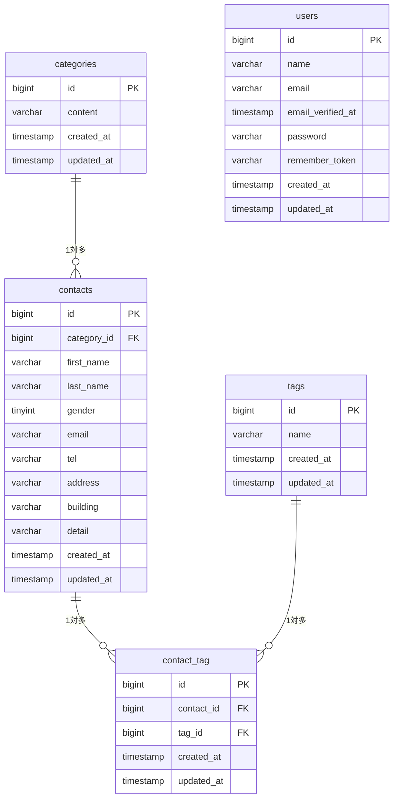

## contact-form-app

## 概要

コーチテック確認テストのお問い合わせフォーム

誰でもお問い合わせを送ることができるお問い合わせフォーム、管理者の登録用画面、管理者ログイン用画面、送られてきたお問い合わせ内容を見ることができる管理画面を作成しました。検索機能やタグの追加、更新、削除などの機能の作成。

## ER図



## 環境構築手順

以下の手順に沿ってローカル開発環境を構築してください。

Markdown

## 環境構築手順

1. リポジトリのクローンと移動

```bash
git clone https://github.com/hayashi-hiroyuki40/contact-form-app.git

cd contact-form-app
```

2. Composer パッケージのインストール

```bash
docker run --rm \
  -u "$(id -u):$(id -g)" \
  -v "$(pwd):/var/www/html" \
  -w /var/www/html \
  -e COMPOSER_CACHE_DIR=/tmp/composer_cache \
  laravelsail/php82-composer:latest \
  composer install
```

3. 環境設定ファイル (.env) の作成

```bash
cp .env.example .env
```

4. Sailの設定ファイル生成 (MySQL)

```bash
docker run --rm \
    -u "$(id -u):$(id -g)" \
    -v "$(pwd):/var/www/html" \
    -w /var/www/html \
    -e COMPOSER_CACHE_DIR=/tmp/composer_cache \
    laravelsail/php82-composer:latest \
    php artisan sail:install --with=mysql
```

※ Apple Silicon (M1/M2/M3) Mac をお使いの場合

sail up -d 実行時に以下のエラーが発生することがあります。

```
no matching manifest for linux/arm64/v8
```

その場合は compose.yaml を開き、mysql サービスに platform: 'linux/amd64' を追加してください。

```yaml
mysql:
image: "mysql/mysql-server:8.0"
platform: "linux/amd64" # ← この行を追加
ports: 5. Dockerコンテナの起動
```

編集後、保存してからsail up -dを実行してください。

5. Dockerコンテナの起動

```bash
./vendor/bin/sail up -d
```

6. アプリケーションキー生成 & データベース構築

```Bash
./vendor/bin/sail artisan key:generate
./vendor/bin/sail artisan migrate --seed
```

※データベースを初期化（リセット）したい場合は以下を実行してください。

```Bash
./vendor/bin/sail artisan migrate:fresh --seed
```

7. フロントエンドのセットアップ

```Bash
# パッケージのインストール
./vendor/bin/sail npm install

# 開発サーバーの起動（実行したままにします）
./vendor/bin/sail npm run dev
```

## 使用技術

- OS
- PHP 8.2
- Laravel 10.x
- MySQL 8.0
- Nginx
- Vite, Tailwind CSS ^3.4.0
- Docker, Laravel Sail, phpMyAdmin
- Git / GitHub
- PHPUnit

## APIエンドポイント一覧

なし

## 開発環境URL

http://localhost

## 作成者

林　裕之
